# Line Follower Robot - Wiring Diagram

## Complete System Wiring Diagram

```mermaid
graph TB
    subgraph Arduino["Arduino UNO"]
        A0["A0<br/>Left Sensor"]
        A1["A1<br/>Right Sensor"]
        P3["Pin 3<br/>Motor B EN"]
        P8["Pin 8<br/>Motor A IN2"]
        P9["Pin 9<br/>Motor A IN1"]
        P10["Pin 10<br/>Motor A EN"]
        P11["Pin 11<br/>Motor B IN3"]
        P12["Pin 12<br/>Motor B IN4"]
        GND1["GND"]
        GND2["GND"]
    end

    subgraph Sensors["Sensors"]
        LS["Left IR Sensor<br/>A0"]
        RS["Right IR Sensor<br/>A1"]
    end

    subgraph Driver["L298N Motor Driver"]
        IN1["IN1"]
        IN2["IN2"]
        EN_A["EN A"]
        OUT_A["Motor A OUT"]
        IN3["IN3"]
        IN4["IN4"]
        EN_B["EN B"]
        OUT_B["Motor B OUT"]
        DGnd["GND"]
        D12V["+12V"]
    end

    subgraph Motors["Motors"]
        M_Left["Left Motor<br/>DC Motor"]
        M_Right["Right Motor<br/>DC Motor"]
    end

    subgraph Power["Power Supply"]
        Pow5["5V Supply<br/>Arduino"]
        Pow12["12V Supply<br/>Motors"]
    end

    A0 --> LS
    A1 --> RS
    P9 --> IN1
    P8 --> IN2
    P10 --> EN_A
    P11 --> IN3
    P12 --> IN4
    P3 --> EN_B
    GND1 --> DGnd
    GND2 --> Pow12
    
    OUT_A --> M_Left
    OUT_B --> M_Right
    D12V --> Pow12
    
    Pow5 --> Arduino
    Pow12 --> Driver

    style Arduino fill:#e1f5ff
    style Driver fill:#fff3e0
    style Sensors fill:#f3e5f5
    style Motors fill:#e8f5e9
    style Power fill:#fce4ec
```



---

## Detailed Pin Connections

### Arduino UNO Pins

| Pin | Function | Direction | Connected To |
|-----|----------|-----------|--------------|
| **A0** | Left Sensor Input | Input | IR Sensor (Left) |
| **A1** | Right Sensor Input | Input | IR Sensor (Right) |
| **GND** | Ground | - | L298N GND, Motor Supply GND |
| **Pin 3** | Motor B Enable (PWM) | Output | L298N EN B |
| **Pin 8** | Motor A Direction 2 | Output | L298N IN2 |
| **Pin 9** | Motor A Direction 1 | Output | L298N IN1 |
| **Pin 10** | Motor A Enable (PWM) | Output | L298N EN A |
| **Pin 11** | Motor B Direction 3 | Output | L298N IN3 |
| **Pin 12** | Motor B Direction 4 | Output | L298N IN4 |

---

## L298N Motor Driver Connections

### Input Pins
| L298N Pin | Arduino Pin | Purpose |
|-----------|-------------|---------|
| IN1 | Pin 9 | Motor A Forward |
| IN2 | Pin 8 | Motor A Backward |
| IN3 | Pin 11 | Motor B Forward |
| IN4 | Pin 12 | Motor B Backward |
| EN A | Pin 10 | Motor A Speed (PWM) |
| EN B | Pin 3 | Motor B Speed (PWM) |

### Output Pins
| L298N Output | Connected To |
|--------------|--------------|
| Motor A (OUT1+, OUT1-) | Left DC Motor |
| Motor B (OUT2+, OUT2-) | Right DC Motor |

### Power Pins
| L298N Pin | Connected To | Voltage |
|-----------|--------------|---------|
| +12V | 12V Power Supply | +12V |
| GND | Common Ground | Ground |

---

## Sensor Connections

### IR Sensor Module (Left - A0)
```
IR Sensor Pin Layout:
+--------+--------+--------+
| VCC    | GND    | OUT    |
+--------+--------+--------+
  |        |        |
  |        |        +---> Arduino A0
  |        +---> Arduino GND
  +---> 5V Power Supply
```

### IR Sensor Module (Right - A1)
```
IR Sensor Pin Layout:
+--------+--------+--------+
| VCC    | GND    | OUT    |
+--------+--------+--------+
  |        |        |
  |        |        +---> Arduino A1
  |        +---> Arduino GND
  +---> 5V Power Supply
```

---

## Motor Driver (L298N) Block Diagram

```
        +---------+---------+
        |   L298N Motor     |
        |      Driver       |
        +---------+---------+
             |
    +---------+---------+---------+
    |         |         |         |
    v         v         v         v
  IN1       IN2       IN3       IN4
   |         |         |         |
   |         |         |         |
  [Motor A Control]  [Motor B Control]
   |                  |
   v                  v
 Motor A            Motor B
(Left Motor)      (Right Motor)
```

---

## Complete Physical Layout Guide

### Top View of Robot Chassis
```
                 FRONT
        +--------------------+
        |    IR Sensors      |
        |   (A0)  (A1)       |
        | Left    Right      |
        |                    |
        |                    |
        |                    |
        |   [Arduino UNO]    |
        |                    |
        |  [L298N Driver]    |
        |                    |
        |  Motor Motor       |
        |  Left  Right       |
        +----+----------+----+
             |          |
          Wheel      Wheel
             
                 BACK
```

### Side View (Motor Mounting)
```
Left Motor          Right Motor
   |                    |
   v                    v
+-----+            +-----+
|  M  |            |  M  |
|  O  |   ...      |  O  |
|  T  |            |  T  |
|  O  |            |  O  |
|  R  |            |  R  |
+-----+            +-----+
   |                    |
   v                    v
Wheel (Left)       Wheel (Right)

... = Chassis / Electronics

Caster Wheel at front (optional)
```

---

## Power Supply Wiring

### Dual Power Supply Recommended

```
+5V Power Supply          12V Power Supply
      |                          |
      |                          |
      +---> Arduino 5V      +---> L298N +12V
      |                          |
      +---> GND             +---> L298N GND
                                  |
                                  +---> Motor Supply
```

### Common Ground Connection
```
Arduino GND ----+
                |
L298N GND ------+---- Common Ground
                |
5V Supply GND --+
12V Supply GND -+
```

**⚠️ IMPORTANT:** Always connect all GNDs together for proper operation!

---

## Wiring Checklist

### Before Powering On
- [ ] Arduino connected to 5V power supply
- [ ] L298N connected to 12V power supply
- [ ] All GND connections secured
- [ ] Left IR sensor → Arduino A0
- [ ] Right IR sensor → Arduino A1
- [ ] Motor A (left) → L298N outputs
- [ ] Motor B (right) → L298N outputs
- [ ] All pins properly inserted (no loose connections)
- [ ] No short circuits between power and GND
- [ ] USB cable connected for programming (optional during operation)

---

## Motor Direction Truth Table

### Motor A (Left Motor) - L298N IN1, IN2, EN A
| IN1 | IN2 | EN A | Direction |
|-----|-----|------|-----------|
| 1 | 0 | PWM | Forward |
| 0 | 1 | PWM | Backward |
| 0 | 0 | - | Stop |
| 1 | 1 | - | Stop |

### Motor B (Right Motor) - L298N IN3, IN4, EN B
| IN3 | IN4 | EN B | Direction |
|-----|-----|------|-----------|
| 1 | 0 | PWM | Forward |
| 0 | 1 | PWM | Backward |
| 0 | 0 | - | Stop |
| 1 | 1 | - | Stop |

---

## Cable Length Recommendations

| Connection | Recommended Length | Notes |
|------------|-------------------|-------|
| Arduino to Sensors | 15-20 cm | Keep short to reduce noise |
| Arduino to L298N | 10-15 cm | Keep organized |
| L298N to Motors | 20-30 cm | Allow motor placement |
| Power Supply Cables | 30+ cm | Main power lines |
| USB Cable (programming) | As needed | Only during uploads |

---

## Troubleshooting Wiring Issues

### Robot won't power on
- Check 5V supply to Arduino
- Check 12V supply to motor driver
- Verify all power connections

### Sensors read all zeros or 1023
- Check sensor power supply
- Verify A0/A1 connections
- Ensure common ground

### Motors don't spin
- Check motor connections to L298N outputs
- Verify EN pin PWM signals (oscilloscope)
- Check motor power supply (12V)

### Motor spins wrong direction
- Swap motor wires at L298N output terminals
- Or change IN1/IN2 logic in code

### Erratic behavior
- Check for loose connections
- Verify no crossed wires
- Ensure proper ground connections
- Check cable shielding if noise issues

---

## Component Specifications Reference

### Arduino UNO
- Operating Voltage: 5V
- Digital I/O Pins: 14 (6 with PWM)
- Analog Input Pins: 6
- PWM Frequency: ~490 Hz (pins 3, 9, 10) / ~980 Hz (pins 5, 6)

### L298N Motor Driver
- Operating Voltage: 5V - 35V
- Max Current per Channel: 2A
- PWM Frequency Support: up to 20kHz

### IR Sensor Module
- Operating Voltage: 3V - 5V
- Output: Analog voltage
- Detection Range: 2-40 cm (typical)
- Frequency: ~38 kHz

### DC Motor (typical specs)
- Voltage: 3V - 6V
- Current: 100-200 mA (no load)
- RPM: 100-300 (varies by model)

---

**Last Updated:** 2026-07-19  
**Diagram Version:** 1.0
